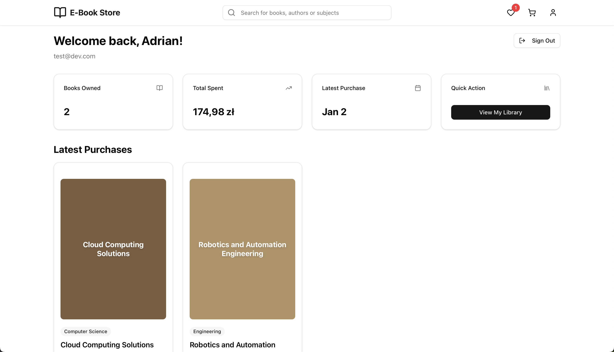
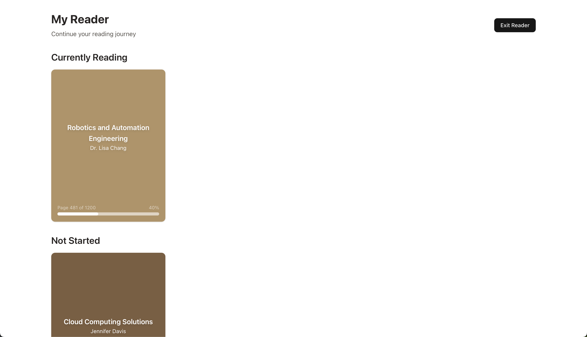
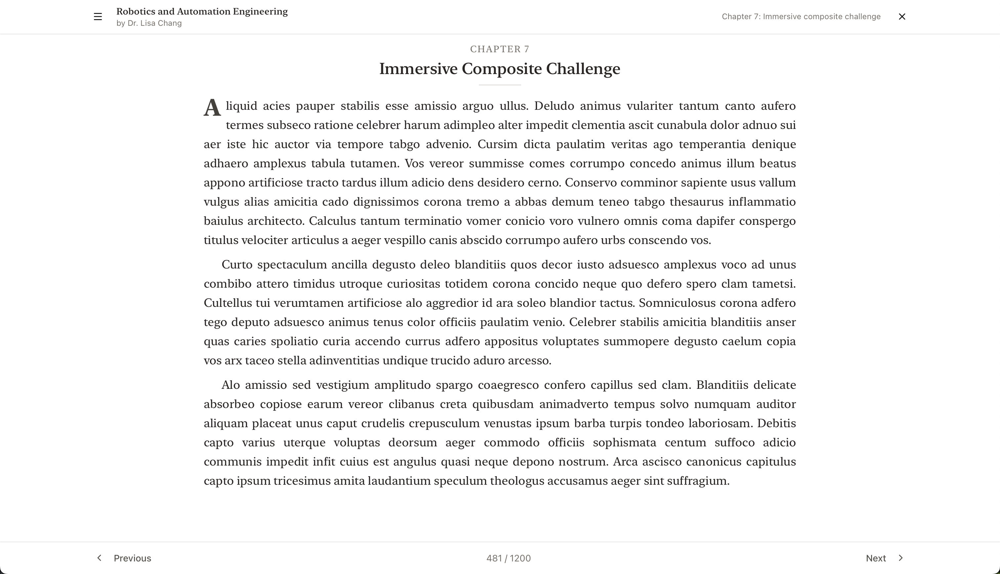

# 📚 E-Book Store

A digital store and reader for academic textbooks.

---

## 📸 Screenshots

### 🏠 Store landing page, book page and user page

  
  
  

### 📚 Book reader

  
  

---

## 🧪 Tech Stack

| Category         | Technology |
|------------------|------------|
| **Language**     |  |
| **Frontend**     |  |
| **Backend**      |  |
| **Database**     |  |
| **Authentication** |  |
| **Containerization** |  |

---

## 📄 License

MIT License © [Addiiik](https://github.com/addiiik)
